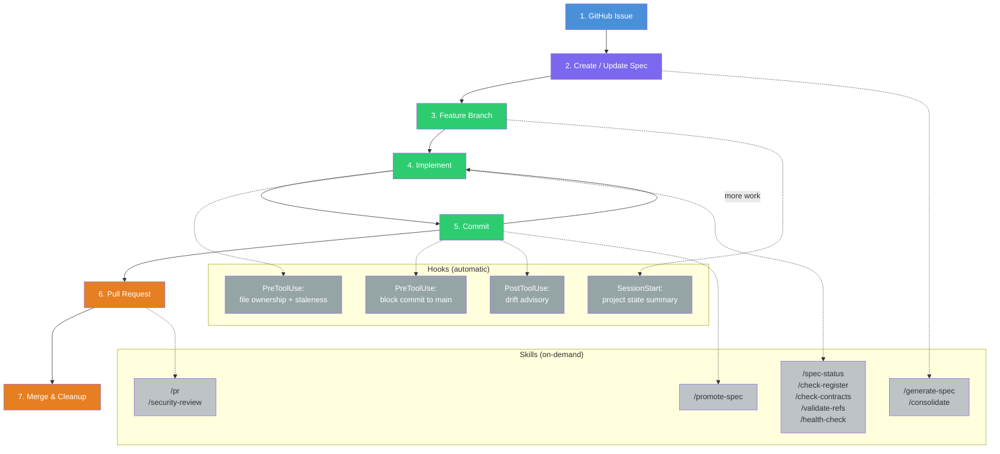
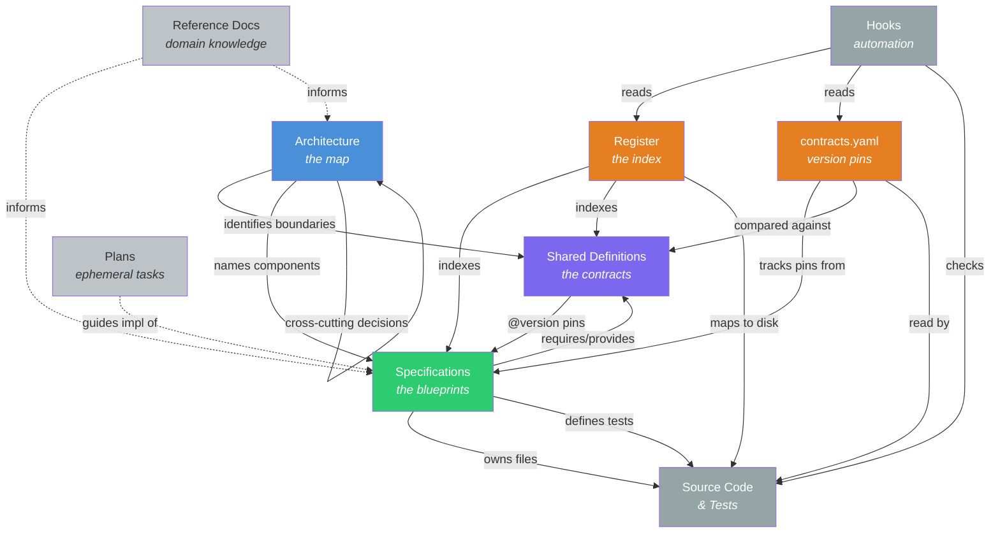

# Spec-Driven Development for AI Code Agents

A document-first workflow for building software with AI coding agents (Claude Code, etc.) where every line of code traces back to a human-authored specification.

## The Problem

AI code agents are powerful implementers but poor architects. Without clear boundaries, they:

- Invent structure and make design decisions that should belong to a human
- Produce code that works but doesn't fit the larger system
- Lose context between sessions, leading to inconsistent decisions
- Can't tell the difference between "I should figure this out" and "I should ask"

The result is software that's built fast but hard to maintain — decisions are buried in code, nothing is traceable, and the human loses control of the design.

## The Solution

Spec-driven development inverts the relationship. The human controls *what* gets built through a system of documents. The AI implements *how*, within the boundaries those documents define. Every file, function, and test traces back to a specification that a human wrote or approved.

This isn't documentation-for-documentation's-sake. Each document type exists because it solves a specific coordination problem between the human architect and the AI implementer.

## Core Principles

**1. Every line of code is owned.** No orphan files, no untracked code. Every source file belongs to exactly one specification, tracked in a central register. If it's not in the register, it shouldn't exist.

**2. The human is the architect.** The AI receives a specification and produces code that satisfies it. It does not invent structure, guess at interfaces, or make design decisions. When something is ambiguous, it stops and asks.

**3. Contracts, not assumptions.** When two modules need to agree on a data shape, that shape is defined once in a shared definition — not inline in two specs that might silently diverge.

**4. Tests are specified, not improvised.** The spec defines what to test. The AI writes the tests. The AI may add supplementary tests, but may not skip or weaken any spec-defined test.

**5. Staleness is detectable.** Version pins, contract tests, and register audits create mechanical checks for drift. When something goes out of sync, it fails visibly rather than rotting silently.

## Issue-to-PR Workflow

Every change follows one of two paths from GitHub issue to merged pull request: **planned** (you know what you're building) or **exploratory** (you're figuring it out). Both paths ensure a governed spec exists before production code is written.

### Workflow Diagram



**Color key:** Blue = planning. Purple = spec authoring. Green = implementation. Orange = review/integration. Dark grey = automatic hooks. Light grey = on-demand skills.

### Two Paths

**Planned path** — for features, bug fixes with known root cause, refactors with clear scope:

```
Issue → Brainstorm (design spec) → Consolidate (governed spec, in-progress) → Branch → Implement → PR
```

The brainstorming skill produces a design spec in `docs/superpowers/specs/`. Before implementation begins, `/consolidate` converts it into a governed spec in `docs/specs/` (or updates an existing one), ensuring hooks and register checks work throughout implementation.

**Exploratory path** — for unknown root causes, unfamiliar domains, evaluating approaches:

```
Issue → Branch → Spike/experiment → Consolidate (governed spec) → Implement properly → PR
```

Spike code answers a question — it's throwaway, not production. After exploration, `/consolidate` formalizes what you learned into a governed spec. Then you implement properly against that spec.

**What both paths share:** they start with an issue, a governed spec exists and is `in-progress` before production code is written, `/consolidate` bridges unstructured thinking and governed specs, and they end with `/pr`.

### Step-by-step

**1. GitHub Issue.** A change starts as a GitHub issue describing what needs to happen and why. Issues are the entry point for all work — features, bugs, refactors, documentation.

**2. Create / update spec.** Before production code is written, the change must be described in a governed specification. There are three ways to get there:

- **Planned new work:** Describe the change to Claude. The brainstorming skill produces a design spec in `docs/superpowers/specs/`. Run `/consolidate` to convert it into a governed spec in `docs/specs/` with the correct format and frontmatter. Use `/promote-spec` to advance it to `in-progress`.

- **Planned change to existing behaviour:** Same as above — brainstorm the change, `/consolidate` updates the existing governed spec rather than creating a new one. If the spec was `implemented`, it moves through `revision-needed` → `in-progress`.

- **Direct spec edit:** For small, well-understood changes where brainstorming would be overhead, edit the governed spec directly. Use `/generate-spec` to scaffold a new spec from a template if needed.

The spec progresses through a state machine: `draft → ready → in-progress → implemented`, with `revision-needed` as a backward path. Code may only be written against a spec with status `in-progress`.

**Permitted without a spec change:** implementation-detail refactoring (preserves behaviour, all tests pass), patch fixes (code didn't match what spec already says), and supplementary test additions.

**3. Feature branch.** Create a feature branch from main. Branch names use prefixes: `feat/`, `fix/`, `docs/`, `chore/`. Never commit directly to main.

When you start a Claude Code session on the branch, the **SessionStart hook** fires automatically — it scans the register, contracts, and specs to produce a compact project state summary (missing documents, spec status breakdown, stale pins, layer-appropriate skills).

**4. Implement.** Write code according to the spec. Every file must be owned by exactly one spec, tracked in `docs/REGISTER.md`.

As you edit, the **PreToolUse hook** fires on every Edit/Write to implementation files — it reports which spec owns the file, whether the spec's definition pins are current, and warns if the file is unowned.

On-demand read-only skills can be invoked at any point during implementation:

| Skill | Purpose |
|---|---|
| `/health-check` | Full drift report across all governed documents |
| `/check-register` | Find unowned files or missing owned files |
| `/check-contracts` | Check version pin staleness |
| `/validate-refs` | Cross-reference consistency |
| `/spec-status` | Dashboard of all specs, statuses, and blockers |

**5. Commit.** Stage files explicitly by name (never `git add -A` or `git add .`). Commit messages explain *why*, not *what*, and reference the GitHub issue (e.g., "Part of #12", "Closes #12"). One logical change per commit.

The **PreToolUse hook** blocks commits to protected branches (main/master) at Layer 2+. After a successful commit, the **PostToolUse hook** produces an advisory: unowned files, definition changes without contract updates, spec changes without register updates.

When implementation is complete, use `/promote-spec` to advance the spec from `in-progress` to `implemented`.

**6. Pull request.** Use `/pr` to create the pull request. It runs a health check, identifies which specs are affected by the changed files, suggests `/security-review` if agent-facing code was modified, pushes the branch, and creates a PR with a spec-aware body including a health check summary.

**7. Merge & cleanup.** After the PR is approved and merged, the GitHub Actions sync workflow (`sync-public.yml`) automatically publishes eligible changes to the public arboretum repo. Locally: switch to main, pull, and delete the feature branch.

### Roadmap

Automation gaps identified for future development:

**High priority:**

| Issue | Gap |
|---|---|
| #50 | **Issue-to-spec linking** — no automation connects a GitHub issue to its owning spec(s) |
| #51 | **Consolidation timing reminder** — nothing reminds you to consolidate before implementation on the planned path |
| #52 | **Post-merge cleanup** — no automation for branch deletion, spec status promotion after merge |

**Normal priority:**

| Issue | Gap |
|---|---|
| #53 | **Spike code guardrails** — nothing prevents spike code from being committed alongside production code |
| #54 | **Pre-PR readiness check** — no lightweight "am I ready?" check before running `/pr` |
| #55 | **Definition impact analysis** — no "what-if" analysis for definition version bumps |
| #56 | **Issue/spec status sync** — spec promotions and issue closures drift independently |

## Document Hierarchy

The workflow uses five governed document types plus ephemeral plans:

```
docs/
  ARCHITECTURE.md          # The map: components, data flows, decisions
  REGISTER.md              # The index: what exists, where, how it connects
  definitions/             # The contracts: shared data shapes, versioned
  specs/                   # The blueprints: what each module does
  reference/               # The context: domain knowledge, business rules
  plans/                   # The tasks: ephemeral implementation steps
```

### Document Relationship Diagram

The following diagram shows how the document types relate to each other and to code:



**Reading the diagram:**
- **Solid arrows** are governed relationships — these must be maintained and are checked by hooks and contract tests.
- **Dashed arrows** are informational relationships — useful but not enforced.
- **Blue** = architectural authority. **Purple** = versioned contracts. **Green** = implementation authority. **Orange** = tracking/indexing. **Grey** = code and automation. **Light grey** = ungoverned context.

### Creation Order

Documents must be created top-down. The AI does not implement code until the full dependency chain exists:

```
Architecture ──→ Definitions ──→ Specs ──→ Register ──→ contracts.yaml ──→ Code
```

### Object Type Summary

Each object type has a distinct role, creation process, and governance model. Templates for all types live in `docs/templates/`.

---

#### Architecture (`docs/ARCHITECTURE.md`)

| Aspect | Detail |
|---|---|
| **What it is** | A concise map of the entire system: components, data model, data flows, integration points, cross-cutting concerns, dependency graph. |
| **What it does** | Orients the AI at the start of every session. Names the architecture owner. Records cross-cutting decisions that affect multiple specs. |
| **How it's created** | Written by the human (architecture owner) before any specs exist. Describes the system at the highest level without implementation details. |
| **How it's governed** | Owned by the architecture owner. Updated whenever specs are added, removed, or fundamentally changed. Changes trigger top-down updates to definitions, then specs, then code. |
| **Key constraints** | ~5,000 word limit (read every session — must be worth the context cost). One per project. Detail belongs in specs, not here. |
| **Template** | `docs/templates/architecture.md` |

---

#### Shared Definition (`docs/definitions/*.md`)

| Aspect | Detail |
|---|---|
| **What it is** | The single source of truth for a data structure, interface, event schema, or type that crosses module boundaries. |
| **What it does** | Ensures two specs that need to agree on a data shape reference one canonical definition rather than maintaining independent copies that might diverge. |
| **How it's created** | Extracted from the architecture's data flows and component boundaries. Starts at status `draft`, version `v0`. Promoted to `stable` / `v1` when the schema is settled. |
| **How it's governed** | Owned by architecture (not any single spec). Changes require architecture owner approval. Every change to a stable definition bumps the version (all bumps are breaking). All consuming specs must review and re-pin. Version pins tracked in three places: the definition file, spec tables, and `contracts.yaml`. |
| **Key constraints** | Describes *what*, not *how*. One notation per project (dataclasses, JSON Schema, SQL DDL, etc.). Draft definitions (v0) are exempt from re-pinning rules. |
| **Template** | `docs/templates/definition.md` |

---

#### Specification (`docs/specs/*.spec.md`)

| Aspect | Detail |
|---|---|
| **What it is** | The sole authority over a bounded piece of implementation. Declares what the code does, what it needs, what it provides, and how correctness is verified. |
| **What it does** | Gives the AI precise, unambiguous instructions for what to build. Defines the testing requirements. Records spec-scoped decisions. Declares environment requirements. |
| **How it's created** | Collaboratively: the human writes Purpose and Behaviour (design intent); the AI fills Requires/Provides tables, test stubs, and boilerplate. The human reviews and approves before implementation begins. |
| **How it's governed** | Owned by spec owner. Progresses through a state machine: `draft → ready → in-progress → implemented`, with `revision-needed` as a backward path. Status transitions have defined triggers (see SPEC-WORKFLOW.md §2). Every source file is owned by exactly one spec. |
| **Key constraints** | Sizing heuristic: single reason to change. Tests required across applicable tiers (unit always; contract and integration when relevant, with explicit N/A otherwise). The Provides table allows inline interface descriptions for simple functions — not everything needs a shared definition. |
| **Template** | `docs/templates/spec-minimal.md` (default) or `docs/templates/spec-full.md` (when shared definitions or cross-spec dependencies are needed) |

---

#### Register (`docs/REGISTER.md`)

| Aspect | Detail |
|---|---|
| **What it is** | A lookup table mapping definitions to versions/consumers, specs to phases/owned files, and providing dependency resolution order. |
| **What it does** | Answers "where does this live?" and "what depends on what?" at a glance. Enables the AI's context derivation procedure. Surfaces unowned code. |
| **How it's created** | Built after all specs and definitions exist. Populated from each spec's Requires/Provides tables and Target Phase fields. Dependency resolution order is a topological sort of the spec graph. |
| **How it's governed** | Manually maintained — updated after every implementation cycle. Audited by the AI: verify files exist on disk, ownership is complete, version pins match, dependency links are accurate. |
| **Key constraints** | Lookup table, not narrative. Must stay in sync with specs and definitions (the audit step catches drift). The "Unowned Code" section should always be empty. Primary Implementor column identifies which spec canonically expresses a definition (use "external" for outside interfaces). |
| **Template** | `docs/templates/register.md` |

---

#### Version Pins (`contracts.yaml`)

| Aspect | Detail |
|---|---|
| **What it is** | A YAML file mapping each spec to the shared definition versions it depends on. The machine-readable counterpart to the human-readable version pins in spec tables. |
| **What it does** | Enables contract tests to programmatically detect version staleness. When a definition bumps from v1 to v2, contract tests for specs still pinned to v1 fail automatically. |
| **How it's created** | Populated from all specs' Requires/Provides tables after specs are written. Updated whenever a spec or definition version changes. |
| **How it's governed** | Owned by `project-infrastructure.spec`. Must stay in sync with spec tables and definition headers (three-way sync). Checked by the SessionStart hook and pre-implementation hook. |
| **Key constraints** | Three sync points are an accepted cost — spec tables are human-readable, `contracts.yaml` is machine-readable, definition headers are canonical. |
| **Template** | `docs/templates/contracts.yaml` |

---

#### Reference Document (`docs/reference/*.md`)

| Aspect | Detail |
|---|---|
| **What it is** | Domain knowledge, governance artifacts, business context, or regulatory material that informs design but is not itself a specification. |
| **What it does** | Provides background context that specs cite in their Behaviour or Implementation Notes sections. Examples: fee code catalogs, project charters, data quality notes. |
| **How it's created** | Written by the human whenever domain knowledge needs to be captured. No required structure — use whatever format serves the content. |
| **How it's governed** | Minimal governance. Owned by the architecture owner or a specific spec if tightly scoped. No versioning, no ownership tracking, no required template. Acknowledged by the workflow but outside the formal model. |
| **Key constraints** | Not a dumping ground. If content is actionable and drives code, it belongs in a spec's Behaviour section, not in a reference doc. |
| **Template** | `docs/templates/reference.md` |

---

#### Plan (`docs/plans/*.md`)

| Aspect | Detail |
|---|---|
| **What it is** | An ephemeral step-by-step implementation guide for a spec. Breaks the spec into sequenced tasks with exact code, commands, and commit points. |
| **What it does** | Guides the AI through implementation in a structured, reviewable sequence. Useful for complex specs where the order of operations matters. |
| **How it's created** | Created when a spec moves to `in-progress`. References exactly one spec. Written by the AI with human review, or by the human directly. |
| **How it's governed** | Not governed. Once the spec reaches `implemented`, the plan is historical context only. Plans may drift from specs during implementation — the spec is always authoritative, not the plan. |
| **Key constraints** | One action per step. Complete code (not pseudocode). Exact commands and expected output. Small, reviewable commits after each task. |
| **Template** | `docs/templates/plan.md` |

## Two Reserved Specs

Every project has two specs that own cross-cutting infrastructure:

**project-infrastructure.spec** — Build config, CI/CD, root package files, documentation infrastructure, dependency management, `contracts.yaml`.

**test-infrastructure.spec** — Test framework config, shared fixtures, golden datasets, integration test harnesses. Integration tests are *defined* by participating specs but *executed* by this spec's harness.

## Testing Strategy

Tests are specified in the spec document and implemented by the AI. Three tiers, required when applicable:

| Tier | Scope | Required When |
|---|---|---|
| **Unit** | Single spec, all dependencies mocked | Always |
| **Contract** | Verify code matches shared definition schemas; check version pins via `contracts.yaml` | Spec references shared definitions |
| **Integration** | Two or more specs interacting | Spec has cross-spec dependencies |

When a tier doesn't apply (e.g., a standalone utility has no integration tests), the spec must explicitly declare `N/A` with a reason. This is a conscious opt-out, not a silent omission.

Contract tests pull version pins from `contracts.yaml` and compare against definition files. When a definition version bumps, contract tests for specs still pinned to the old version fail automatically.

Tests run in tier order: unit → contract → integration. A failure at any tier blocks the next.

## AI Workflow

### Draft Mode

During early development when everything is `draft`, the AI notes ambiguities and continues rather than stopping. Hard stops are reserved for contradictions and infeasibility. This prevents the workflow from grinding to a halt while documents are being shaped.

Once documents reach `ready` or `stable`, the strict "stop and report" rule applies.

### Revision Protocol

When the AI discovers during implementation that a spec's approach is wrong (not ambiguous — wrong), it:

1. Stops implementation of the affected part
2. Documents what failed and why
3. Proposes 1-3 alternatives with trade-offs
4. Sets the spec to `revision-needed`
5. Continues implementing unaffected parts

The human reviews, selects an approach, and updates the spec.

## Automation Reference

### Hooks

Shell-based hooks fire automatically during Claude Code sessions. All hooks degrade gracefully when governed documents don't exist yet.

| Hook | Trigger | Action | Blocking? |
|---|---|---|---|
| **SessionStart** | Session init | Project state summary (specs, stale pins, missing docs) | No |
| **PreToolUse** (Edit/Write) | Before editing implementation files | File ownership, spec status, staleness warnings | No |
| **PreToolUse** (git commit) | Before commit to main/master (Layer 2+) | Blocks commit to protected branch | Yes |
| **PostToolUse** (git commit) | After commit (Layer 2+) | Advisory: unowned files, unsync'd docs | No |

### Slash Skills

Skills live in `.claude/skills/<name>/SKILL.md`. Read-only skills can be invoked proactively by Claude; write skills require explicit user invocation.

| Skill | Type | What it does |
|---|---|---|
| `/health-check` | Read | Full 6-check drift report |
| `/check-contracts` | Read | Version pin staleness check |
| `/check-register` | Read | File ownership audit |
| `/validate-refs` | Read | Cross-reference consistency |
| `/spec-status` | Read | Spec dashboard (statuses, deps, blockers) |
| `/sync-contracts` | Write | Regenerate `contracts.yaml` from spec tables (dry-run first) |
| `/promote-spec` | Write | Advance spec through status state machine |
| `/generate-spec` | Write | Interactive generator for specs, definitions, architecture, reference docs |
| `/generate-register` | Write | Auto-generate `REGISTER.md` from spec frontmatter |
| `/consolidate` | Write | Formalize code changes into governed specs |
| `/init-project` | Write | Bootstrap a new spec-driven project |
| `/pr` | Write | Create spec-aware pull request with health check summary |
| `/security-review` | Write | Prompt injection analysis for agent-facing code |

## Anti-Patterns

| Pattern | Problem | Fix |
|---|---|---|
| **Inline schemas** | Two specs define the same data shape | Extract to shared definition |
| **Orphan code** | Files no spec claims | Assign to a spec or delete |
| **Spec-to-spec coupling** | Spec A uses Spec B's internals directly | Extract interface to a definition |
| **Ghost dependencies** | Code imports from a module not in Requires | Audit imports against declared Requires |
| **Architecture drift** | Architecture doc doesn't match specs | Update architecture when specs change |
| **Junk-drawer specs** | One spec accumulates unrelated code | Split by single-reason-to-change |
| **Stale decisions** | Recorded decision invalidated but not updated | Supersede with reference to new decision |
| **Phase leakage** | Work bleeds into unplanned phases | Register enforces phase boundaries |
| **Premature strictness** | Strict versioning on draft definitions | Use v0 for drafts; strict rules after `stable` |

## Getting Started

### For a New Project

1. Copy `SPEC-WORKFLOW.md`, `docs/templates/`, and `.claude/` (hooks + settings) to your project
2. Write `docs/ARCHITECTURE.md` using `docs/templates/architecture.md` — components, data model, data flows
3. Create the two reserved specs: `project-infrastructure.spec.md` and `test-infrastructure.spec.md`
4. Extract shared definitions from the architecture's data flows — all start at v0 (draft)
5. Write feature specs — one per component, human writes Behaviour, AI fills boilerplate
6. Build `docs/REGISTER.md` — map everything together
7. Create `contracts.yaml` — populate version pins from spec tables
8. Implement in phase + dependency order

**Creation order is strict.** Architecture before definitions, definitions before specs, specs before register. Don't implement code until the dependency chain of documents exists.

### For an Existing Project

1. Copy `SPEC-WORKFLOW.md` and `.claude/` to your project
2. Classify existing documents: which are specs, which are reference, which are legacy
3. Extract shared definitions from inline schemas
4. Create architecture document from existing design docs
5. Convert or create specs following the template
6. Build the register
7. Create `contracts.yaml`

See the migration plan approach: identify legacy documents, classify them, extract content top-down, then implement.

## File Inventory

```
SPEC-WORKFLOW.md                          # The full workflow specification
contracts.yaml                            # Version pins for contract test enforcement
.claude/
  settings.json                           # Hook configuration
  hooks/
    session-start.sh                      # SessionStart: project state summary
    pre-implementation-check.sh           # PreToolUse: staleness check on Edit/Write
    post-commit-check.sh                  # PostToolUse: register sync check after commits
  skills/                                 # Slash skills for on-demand workflow operations
    health-check/SKILL.md                 #   /health-check — full drift report
    check-contracts/SKILL.md              #   /check-contracts — version pin staleness
    check-register/SKILL.md               #   /check-register — file ownership audit
    sync-contracts/SKILL.md               #   /sync-contracts — regenerate contracts.yaml
    validate-refs/SKILL.md                #   /validate-refs — cross-reference consistency
    spec-status/SKILL.md                  #   /spec-status — spec dashboard
    promote-spec/SKILL.md                 #   /promote-spec — status state machine
    generate-spec/SKILL.md                #   /generate-spec — document generator
    init-project/SKILL.md                 #   /init-project — project bootstrapper
docs/
  ARCHITECTURE.md                         # System architecture
  REGISTER.md                             # File/spec/definition index
  templates/                              # Starter templates for all object types
    architecture.md                       #   Architecture document template
    definition.md                         #   Shared definition template
    spec-minimal.md                       #   Specification template (standalone, default)
    spec-full.md                          #   Specification template (shared definitions / cross-spec deps)
    register.md                           #   Register template
    contracts.yaml                        #   contracts.yaml template
    plan.md                               #   Implementation plan template
    reference.md                          #   Reference document template
  definitions/                            # Shared data contracts (versioned)
  specs/                                  # Implementation specifications
  reference/                              # Domain knowledge, business context
  plans/                                  # Ephemeral implementation plans
```

## Design Decisions Behind the Workflow

| Decision | Rationale |
|---|---|
| v0 for draft definitions | Prevents version churn during initial design. Normal rules apply after `stable`. |
| Three sync points for version pins | Accepted cost. Spec tables are human-readable, `contracts.yaml` is machine-readable, definition headers are canonical. |
| Contract/integration tests required only when applicable | Standalone utilities shouldn't need vacuous test sections. Explicit N/A prevents silent omission. |
| Architecture doc size cap (~5K words) | Read every session — must be worth the context cost. Push detail into specs. |
| Collaborative spec authoring | Humans own design intent (Behaviour), AI handles traceability (Requires/Provides tables). Splits work at the right seam. |
| Register is manually maintained | Honest about the cost. An audit step catches drift rather than pretending automation exists. |
| Draft mode for early development | Strict "stop and report" blocks progress when everything is being shaped simultaneously. Note and continue, hard-stop only on contradictions. |
| Strict creation order | Prevents the AI from implementing against incomplete or missing specs. Slower start, cleaner foundation. |

## Scope and Limitations

This workflow is designed for:
- **Solo developer + AI agent** projects where one person plays all roles (architecture owner, spec author, reviewer)
- **Small to medium codebases** where the document overhead is proportional to the code
- **Claude Code** as the primary AI agent (hooks use Claude Code's event system)

It may need adaptation for:
- **Team projects** with multiple spec authors (add approval workflows, branch-per-spec)
- **Large codebases** where the register becomes unwieldy (consider generated registers)
- **Other AI agents** (hooks are Claude Code-specific; the document structure is universal)
